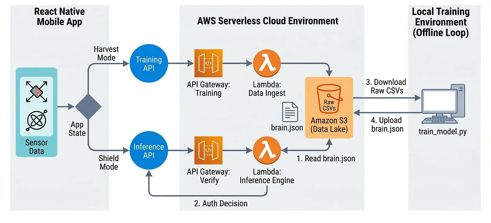

# Mobile Kinetics Authenticator

## Overview
Traditional mobile authentication mechanisms secure the initial entry point but grant implicit trust while the session is active. If an unlocked device is physically snatched, threat actors inherit all active session tokens because the operating system assumes the current physical operator is still the authenticated user.

This project solves this post-authentication vulnerability via **Zero Trust** principles. Instead of relying on a single perimeter check (like a fingerprint or FaceID) that grants implicit trust for an entire session, this system operates on the assumption that the device could be compromised at any given second. By passively profiling the authorized user's physical micro-movements, currently utilizing strictly 6-axis kinetic telemetry from the device's accelerometer and gyroscope, the architecture continuously verifies the physical identity of the operator in the background.

It utilizes an offline unsupervised machine learning pipeline (K-Means clustering) to establish a mathematical behavioral baseline. A serverless AWS edge architecture evaluates live telemetry against this baseline, instantly locking the device and revoking tokens if an anomaly (such as a physical snatch) is detected, ensuring trust is continuously earned rather than blindly granted.

## Core Features
* Continuous Zero-Trust Verification: Solves the physical session hijacking problem by shifting mobile security from a static perimeter defense to dynamic, ongoing behavioral verification.
* Dual-State Mobile Client: A React Native application featuring a "Harvest Mode" for baseline data collection and a "Shield Mode" for active event-driven protection.
* Hardware-Level Noise Filtering: Implements a localized rolling moving average and a strict 0.2G hardware trigger threshold to eliminate transient noise and preserve battery life.
* Unsupervised Machine Learning: Uses Python and Scikit-Learn (K-Means) to extract unique behavioral centroids from 6-dimensional kinetic telemetry.
* Serverless Edge Inference: Utilizes AWS Lambda and API Gateway for sub-second anomaly detection based on a strict 40% Euclidean distance variance margin.
* Infrastructure as Code: The entire AWS environment is declaratively provisioned using HashiCorp Terraform.

## System Architecture



## Repository Structure
```text
Mobile-Kinetics-Authenticator/
  |-- mobile-app/          (React Native client application)
  |-- ml-training/         (Python scripts for K-Means clustering and PCA visualization)
  |-- terraform/           (IaC configurations for AWS deployment)
  |-- images/              (Contains architecture diagrams and report figures)
  |-- README.md            (Project documentation)
```

---

## Step-by-Step Setup Guide

### Prerequisites
Before starting, ensure you have the following installed on your local machine:
* Node.js and npm (for React Native)
* React Native CLI and Android Studio / Xcode (for mobile emulation)
* Python 3.8+ and pip
* AWS CLI (configured with your IAM credentials)
* HashiCorp Terraform

### Step 1: Package the Serverless Functions
AWS Lambda requires your Python execution code to be packaged into `.zip` archives before Terraform can deploy them to the cloud.

1. Open your terminal and navigate to the Terraform directory:
   ```bash
   cd Terraform
   ```
2. Zip the individual function files:
   ```bash
   zip ingest.zip lambda_ingest.py
   zip verify.zip lambda_verify.py
   ```

### Step 2: Provision the AWS Infrastructure
Navigate to the Terraform directory to deploy the serverless environment, which includes the Amazon S3 Data Lake, API Gateways, and Lambda functions.

1. Open your terminal and navigate to the terraform folder:
   ```bash
   cd terraform
   ```
2. Initialize Terraform to download necessary providers:
   ```bash
   terraform init
   ```
3. Review the deployment plan:
   ```bash
   terraform plan
   ```
4. Apply the configuration to build the architecture:
   ```bash
   terraform apply
   ```

*Note: Make sure to copy the outputted S3 Bucket Name and the API Gateway URLs. You will need these for the subsequent steps.*

### Step 3: Configure the Local Machine Learning Environment
Set up the Python environment required to process the data and train the K-Means model.

1. Navigate to the machine learning directory:
   ```bash
   cd ../ml-training
   ```
2. Install the required Python dependencies:
   ```bash
   pip install boto3 scikit-learn numpy matplotlib
   ```
3. Open `train_model.py` in your code editor and update the `BUCKET_NAME` variable with the exact S3 bucket name generated by Terraform in Step 2.

### Step 4: Configure and Build the Mobile App
Set up the React Native frontend that will capture the kinetic telemetry and interface with your AWS backend.

1. Navigate to the mobile application directory:
   ```bash
   cd ../mobile-app
   ```
2. Install the Node dependencies:
   ```bash
   npm install
   ```
3. Open the main networking/configuration file in the React Native codebase and paste the API Gateway URLs generated in Step 2.
4. Launch the application on your emulator or connected physical device:
   
   For Android:
   ```bash
   npx react-native run-android 
   ```
   For iOS:
   ```bash
   npx react-native run-ios
   ```

### Step 5: Operational Workflow (Testing the System)
With the infrastructure deployed and the app running, follow this sequence to test the continuous authentication loop.

1. **Data Harvesting:** Open the mobile app and activate "Harvest Mode." Use the phone normally (typing, scrolling, walking) to generate baseline kinetic telemetry. This data is automatically routed through the API Gateway and stored in your S3 Data Lake.
2. **Model Training:** Return to your terminal in the `ml-training` directory and run the training script:
   ```bash
   python train_model.py
   ```
   *This will download the raw CSVs, calculate the K-Means behavioral centroids, generate a 3D PCA visualization locally, and upload the finalized `brain.json` back to S3.*
3. **Active Protection:** Switch the mobile app to "Shield Mode." The app is now actively monitoring your movements. 
4. **Triggering the Anomaly:** Simulate a snatch attack by physically jerking the device. The app will detect the 0.2G threshold breach and ping the AWS Inference Lambda. The cloud will calculate the variance, reject the authorization, and the app will instantly display the hardware lock screen.

**DISCLAIMER:** This project was developed strictly for educational and academic research purposes. It is a proof-of-concept demonstrating continuous behavioral authentication via hardware telemetry. It is not intended, nor audited, for use in production environments or for securing actual sensitive personal or corporate data.